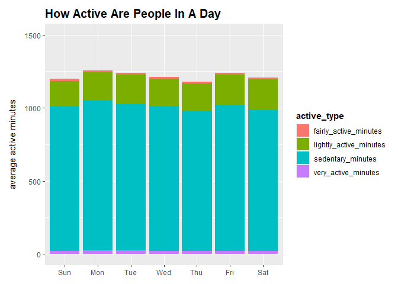

Smart fitness devices trends
================
Karanja David
February 27, 2022

# Bellabeat Wellness Technology Company

Bellabeat is a high-tech manufacturer of health-focused products for
women. Bellabeat is a successful small company with the potential to
become a larger player in the global smart device market. Urška Sršen,
cofounder and Chief Creative Officer of Bellabeat, believes that
analyzing smart device fitness data could help unlock new growth
opportunities for the company.

## Business task

1.Focus on one of Bellabeat’s products and analyze smart device data to
gain insight into how consumers are using their smart devices.

2.The insights you discover will then help guide marketing strategy for
the company.Provide high-level recommendations for Bellabeat’s marketing
strategy

### Stakeholders and Products

● Stakeholders

1.Urška Sršen: Bellabeat’s cofounder and Chief Creative Officer. 2.Sando
Mur: Mathematician and Bellabeat’s cofounder; key member of the
Bellabeat executive team. 3.Bellabeat marketing analytics team: A team
of data analysts responsible for collecting, analyzing, and reporting
data that helps guide Bellabeat’s marketing strategy.

● Products

1.Bellabeat app: The Bellabeat app provides users with health data
related to their activity, sleep, stress, menstrual cycle, and
mindfulness habits. This data can help users better understand their
current habits and make healthy decisions. The Bellabeat app connects to
their line of smart wellness products.

2.Leaf: Bellabeat’s classic wellness tracker can be worn as a bracelet,
necklace, or clip. The Leaf tracker connects to the Bellabeat app to
track activity, sleep, and stress.

3.Time: This wellness watch combines the timeless look of a classic
timepiece with smart technology to track user activity, sleep, and
stress. The Time watch connects to the Bellabeat app to provide you with
insights into your daily wellness.

4.Spring: This is a water bottle that tracks daily water intake using
smart technology to ensure that you are appropriately hydrated
throughout the day. The spring bottle connects to the Bellabeat app to
track your hydration levels.

5.Bellabeat membership: Bellabeat also offers a subscription-based
membership program for users. Membership gives users 24/7 access to
fully personalized guidance on nutrition, activity, sleep, health and
beauty, and mindfulness based on their lifestyle and goals.

# Prepare

load libraries

``` r
#Loading libraries (set up the environment) 
library(tidyverse)
library(here)
library(janitor)
library(skimr)
library(hms)
library(lubridate)
```

The data needed for the project.

``` r
#Import data to use in the project.

daily_activity <- read_csv("dailyActivity_merged.csv")
hourly_cal <- read_csv("hourlyCalories_merged.csv")
hourly_intensity <- read_csv("hourlyIntensities_merged.csv")
hourly_steps <- read_csv("hourlySteps_merged.csv")
sleep_day <- read_csv("sleepDay_merged.csv")
weight_log_info <- read.csv("weightLogInfo_merged.csv")
```

# Process

Explore the data frames structure

``` r
glimpse(daily_activity)
```

    ## Rows: 940
    ## Columns: 15
    ## $ Id                       <dbl> 1503960366, 1503960366, 1503960366, 150396036~
    ## $ ActivityDate             <chr> "4/12/2016", "4/13/2016", "4/14/2016", "4/15/~
    ## $ TotalSteps               <dbl> 13162, 10735, 10460, 9762, 12669, 9705, 13019~
    ## $ TotalDistance            <dbl> 8.50, 6.97, 6.74, 6.28, 8.16, 6.48, 8.59, 9.8~
    ## $ TrackerDistance          <dbl> 8.50, 6.97, 6.74, 6.28, 8.16, 6.48, 8.59, 9.8~
    ## $ LoggedActivitiesDistance <dbl> 0, 0, 0, 0, 0, 0, 0, 0, 0, 0, 0, 0, 0, 0, 0, ~
    ## $ VeryActiveDistance       <dbl> 1.88, 1.57, 2.44, 2.14, 2.71, 3.19, 3.25, 3.5~
    ## $ ModeratelyActiveDistance <dbl> 0.55, 0.69, 0.40, 1.26, 0.41, 0.78, 0.64, 1.3~
    ## $ LightActiveDistance      <dbl> 6.06, 4.71, 3.91, 2.83, 5.04, 2.51, 4.71, 5.0~
    ## $ SedentaryActiveDistance  <dbl> 0, 0, 0, 0, 0, 0, 0, 0, 0, 0, 0, 0, 0, 0, 0, ~
    ## $ VeryActiveMinutes        <dbl> 25, 21, 30, 29, 36, 38, 42, 50, 28, 19, 66, 4~
    ## $ FairlyActiveMinutes      <dbl> 13, 19, 11, 34, 10, 20, 16, 31, 12, 8, 27, 21~
    ## $ LightlyActiveMinutes     <dbl> 328, 217, 181, 209, 221, 164, 233, 264, 205, ~
    ## $ SedentaryMinutes         <dbl> 728, 776, 1218, 726, 773, 539, 1149, 775, 818~
    ## $ Calories                 <dbl> 1985, 1797, 1776, 1745, 1863, 1728, 1921, 203~

``` r
glimpse(hourly_cal)
```

    ## Rows: 22,099
    ## Columns: 3
    ## $ Id           <dbl> 1503960366, 1503960366, 1503960366, 1503960366, 150396036~
    ## $ ActivityHour <chr> "4/12/2016 12:00:00 AM", "4/12/2016 1:00:00 AM", "4/12/20~
    ## $ Calories     <dbl> 81, 61, 59, 47, 48, 48, 48, 47, 68, 141, 99, 76, 73, 66, ~

``` r
glimpse(hourly_intensity)
```

    ## Rows: 22,099
    ## Columns: 4
    ## $ Id               <dbl> 1503960366, 1503960366, 1503960366, 1503960366, 15039~
    ## $ ActivityHour     <chr> "4/12/2016 12:00:00 AM", "4/12/2016 1:00:00 AM", "4/1~
    ## $ TotalIntensity   <dbl> 20, 8, 7, 0, 0, 0, 0, 0, 13, 30, 29, 12, 11, 6, 36, 5~
    ## $ AverageIntensity <dbl> 0.333333, 0.133333, 0.116667, 0.000000, 0.000000, 0.0~

``` r
glimpse(hourly_steps)
```

    ## Rows: 22,099
    ## Columns: 3
    ## $ Id           <dbl> 1503960366, 1503960366, 1503960366, 1503960366, 150396036~
    ## $ ActivityHour <chr> "4/12/2016 12:00:00 AM", "4/12/2016 1:00:00 AM", "4/12/20~
    ## $ StepTotal    <dbl> 373, 160, 151, 0, 0, 0, 0, 0, 250, 1864, 676, 360, 253, 2~

``` r
glimpse(sleep_day)
```

    ## Rows: 413
    ## Columns: 5
    ## $ Id                 <dbl> 1503960366, 1503960366, 1503960366, 1503960366, 150~
    ## $ SleepDay           <chr> "4/12/2016 12:00:00 AM", "4/13/2016 12:00:00 AM", "~
    ## $ TotalSleepRecords  <dbl> 1, 2, 1, 2, 1, 1, 1, 1, 1, 1, 1, 1, 1, 1, 1, 1, 1, ~
    ## $ TotalMinutesAsleep <dbl> 327, 384, 412, 340, 700, 304, 360, 325, 361, 430, 2~
    ## $ TotalTimeInBed     <dbl> 346, 407, 442, 367, 712, 320, 377, 364, 384, 449, 3~

``` r
summary(weight_log_info)
```

    ##        Id                Date              WeightKg       WeightPounds  
    ##  Min.   :1.504e+09   Length:67          Min.   : 52.60   Min.   :116.0  
    ##  1st Qu.:6.962e+09   Class :character   1st Qu.: 61.40   1st Qu.:135.4  
    ##  Median :6.962e+09   Mode  :character   Median : 62.50   Median :137.8  
    ##  Mean   :7.009e+09                      Mean   : 72.04   Mean   :158.8  
    ##  3rd Qu.:8.878e+09                      3rd Qu.: 85.05   3rd Qu.:187.5  
    ##  Max.   :8.878e+09                      Max.   :133.50   Max.   :294.3  
    ##                                                                         
    ##       Fat             BMI        IsManualReport         LogId          
    ##  Min.   :22.00   Min.   :21.45   Length:67          Min.   :1.460e+12  
    ##  1st Qu.:22.75   1st Qu.:23.96   Class :character   1st Qu.:1.461e+12  
    ##  Median :23.50   Median :24.39   Mode  :character   Median :1.462e+12  
    ##  Mean   :23.50   Mean   :25.19                      Mean   :1.462e+12  
    ##  3rd Qu.:24.25   3rd Qu.:25.56                      3rd Qu.:1.462e+12  
    ##  Max.   :25.00   Max.   :47.54                      Max.   :1.463e+12  
    ##  NA's   :65

## confirm credibility of the data

The data is public data from FitBit Fitness Tracker Data. It’s a dataset
from thirty fitbit users that includes minute-level output for physical
activity, heart rate, and sleep monitoring.

## Explore the data further

### For how long was the data collected?

``` r
# first day of data collection
min(daily_activity$ActivityDate)
```

    ## [1] "4/12/2016"

``` r
# last day of data collection
max(daily_activity$ActivityDate)
```

    ## [1] "5/9/2016"

Data collected for approximately a month. Between 12th April to 9th May
2016.

### How many unique people are represented in the data?

``` r
unique_people <- data.frame(
  name = c("daily_activity", "hourly_cal", "hourly_intensity",
           "hourly_steps", "sleep_day", "weight_log_info"), 
  id_count = c(n_distinct(daily_activity$Id), n_distinct(hourly_cal$Id), 
               n_distinct(hourly_intensity$Id), n_distinct(hourly_steps$Id), 
               n_distinct(sleep_day$Id), n_distinct(weight_log_info$Id)))
unique_people
```

    ##               name id_count
    ## 1   daily_activity       33
    ## 2       hourly_cal       33
    ## 3 hourly_intensity       33
    ## 4     hourly_steps       33
    ## 5        sleep_day       24
    ## 6  weight_log_info        8

### Quick notes from the exploration.

1.  Names of columns are in Pascal case.

2.  Date columns are in character data type.

3.  Weight log info data frame has 65 NULLs.

4.  The data covers one month period.

5.  Number of unique people represented in the data is as follows: Data
    frames: daily_activity, hourly_cal, hourly_intensity, hourly_steps
    all have 33 users. Sleep_day has 24 while weight_log_info has 8
    unique users.

6.  The data was collected from 12th April 2016 to 9th May 2016. Highest
    number of days recorded is 31 while the least is 4 days.

## Clean and Transform the data

### Clean all column names for better readability and uniformity.

``` r
daily_activity <- clean_names(daily_activity)
hourly_cal <- clean_names(hourly_cal)
hourly_intensity <- clean_names(hourly_intensity)
hourly_steps <- clean_names(hourly_steps)
sleep_day <- clean_names(sleep_day)
weight_log_info <- clean_names(weight_log_info)
```

### Transform the data frames

#### daily_activity dataframe

1.  Create new data frame to avoid tampering with the existing one.

2.  daily_activity has its date in character data type. Change it to
    date data type.

3.  Tracker distance column is unnecessary - delete it.

4.  Ensure the date format is mdy.

5.  Link each date to a week day. Eg. Monday, Tuesday …Sunday

6.  Filter out the user whose data is collected for only 4 days the
    entire month. If not filtered out, it might skew the analysis
    results.

``` r
daily_df <- daily_activity %>%
  select(-tracker_distance) %>% 
  mutate(activity_date = mdy(daily_activity$activity_date))
daily_df$day_of_week <- wday(daily_df$activity_date, label = TRUE)
daily_df$week_no <- week(daily_df$activity_date)
daily_df <- filter(daily_df, id != 4057192912)
```

``` r
# glimpse of the data frame
glimpse(daily_df)
```

    ## Rows: 936
    ## Columns: 16
    ## $ id                         <dbl> 1503960366, 1503960366, 1503960366, 1503960~
    ## $ activity_date              <date> 2016-04-12, 2016-04-13, 2016-04-14, 2016-0~
    ## $ total_steps                <dbl> 13162, 10735, 10460, 9762, 12669, 9705, 130~
    ## $ total_distance             <dbl> 8.50, 6.97, 6.74, 6.28, 8.16, 6.48, 8.59, 9~
    ## $ logged_activities_distance <dbl> 0, 0, 0, 0, 0, 0, 0, 0, 0, 0, 0, 0, 0, 0, 0~
    ## $ very_active_distance       <dbl> 1.88, 1.57, 2.44, 2.14, 2.71, 3.19, 3.25, 3~
    ## $ moderately_active_distance <dbl> 0.55, 0.69, 0.40, 1.26, 0.41, 0.78, 0.64, 1~
    ## $ light_active_distance      <dbl> 6.06, 4.71, 3.91, 2.83, 5.04, 2.51, 4.71, 5~
    ## $ sedentary_active_distance  <dbl> 0, 0, 0, 0, 0, 0, 0, 0, 0, 0, 0, 0, 0, 0, 0~
    ## $ very_active_minutes        <dbl> 25, 21, 30, 29, 36, 38, 42, 50, 28, 19, 66,~
    ## $ fairly_active_minutes      <dbl> 13, 19, 11, 34, 10, 20, 16, 31, 12, 8, 27, ~
    ## $ lightly_active_minutes     <dbl> 328, 217, 181, 209, 221, 164, 233, 264, 205~
    ## $ sedentary_minutes          <dbl> 728, 776, 1218, 726, 773, 539, 1149, 775, 8~
    ## $ calories                   <dbl> 1985, 1797, 1776, 1745, 1863, 1728, 1921, 2~
    ## $ day_of_week                <ord> Tue, Wed, Thu, Fri, Sat, Sun, Mon, Tue, Wed~
    ## $ week_no                    <dbl> 15, 15, 15, 16, 16, 16, 16, 16, 16, 16, 17,~

#### hourly data

1.  use hourly cal, hourly intensity and hourly steps data frames.

2.  Merge the three data frames into one using inner joins. Merged data
    is easily accessible and compatible for analysis.

3.  The three data frames have id and activity hour in common.

4.  Format the activity hour column to mdy_hms date format. Remove
    AM/PM.

5.  Add new columns of date and time derived from activity\_ hour
    column.

``` r
hourly_df <- inner_join(inner_join(hourly_cal, hourly_intensity, by = c(
  "id", "activity_hour")), hourly_steps, by = c(
    "id", "activity_hour"))
hourly_df$activity_hour <- mdy_hms(hourly_df$activity_hour)
hourly_df$date <- as_date(hourly_df$activity_hour)
hourly_df$time <- as_hms(hourly_df$activity_hour)
hourly_df$weekday <- wday(hourly_df$activity_hour, label = TRUE)
hourly_df <- filter(hourly_df, id != 4057192912)
```

``` r
# glimpse the hourly data
glimpse(hourly_df)
```

    ## Rows: 22,011
    ## Columns: 9
    ## $ id                <dbl> 1503960366, 1503960366, 1503960366, 1503960366, 1503~
    ## $ activity_hour     <dttm> 2016-04-12 00:00:00, 2016-04-12 01:00:00, 2016-04-1~
    ## $ calories          <dbl> 81, 61, 59, 47, 48, 48, 48, 47, 68, 141, 99, 76, 73,~
    ## $ total_intensity   <dbl> 20, 8, 7, 0, 0, 0, 0, 0, 13, 30, 29, 12, 11, 6, 36, ~
    ## $ average_intensity <dbl> 0.333333, 0.133333, 0.116667, 0.000000, 0.000000, 0.~
    ## $ step_total        <dbl> 373, 160, 151, 0, 0, 0, 0, 0, 250, 1864, 676, 360, 2~
    ## $ date              <date> 2016-04-12, 2016-04-12, 2016-04-12, 2016-04-12, 201~
    ## $ time              <time> 00:00:00, 01:00:00, 02:00:00, 03:00:00, 04:00:00, 0~
    ## $ weekday           <ord> Tue, Tue, Tue, Tue, Tue, Tue, Tue, Tue, Tue, Tue, Tu~

#### Transform sleep data

1.  Add a new column showing time people spend resting in bed

2.  format the date. split the day and time.

3.  The time is not necessary since it is 12:00:00 AM all through.

4.  Filter out people sleeping less than 100 mins

``` r
sleep_day_df <- mutate(sleep_day, 
                       rest_bed_time = total_time_in_bed - total_minutes_asleep)
sleep_day_df$sleep_day = mdy_hms(sleep_day_df$sleep_day)
sleep_day_df$date <- as_date(sleep_day_df$sleep_day)
sleep_day_df <- filter(sleep_day_df, id != 4057192912, total_time_in_bed > 100)
```

``` r
# glimpse the df
glimpse(sleep_day_df)
```

    ## Rows: 404
    ## Columns: 7
    ## $ id                   <dbl> 1503960366, 1503960366, 1503960366, 1503960366, 1~
    ## $ sleep_day            <dttm> 2016-04-12, 2016-04-13, 2016-04-15, 2016-04-16, ~
    ## $ total_sleep_records  <dbl> 1, 2, 1, 2, 1, 1, 1, 1, 1, 1, 1, 1, 1, 1, 1, 1, 1~
    ## $ total_minutes_asleep <dbl> 327, 384, 412, 340, 700, 304, 360, 325, 361, 430,~
    ## $ total_time_in_bed    <dbl> 346, 407, 442, 367, 712, 320, 377, 364, 384, 449,~
    ## $ rest_bed_time        <dbl> 19, 23, 30, 27, 12, 16, 17, 39, 23, 19, 46, 29, 2~
    ## $ date                 <date> 2016-04-12, 2016-04-13, 2016-04-15, 2016-04-16, ~

#### Transform weight data

1.  Get rid of unnecessary columns

2.  Format the date

3.  filter out id 4057192912

``` r
weight_df <- weight_log_info %>%
  select(-weight_pounds, -log_id, -fat)
weight_df$date <- mdy_hms(weight_df$date)
weight_df$dates <- as_date(weight_df$date)
weight_df <- filter(weight_df, id != 4057192912)
```

``` r
# glimpse the weight data
glimpse(weight_df)
```

    ## Rows: 67
    ## Columns: 6
    ## $ id               <dbl> 1503960366, 1503960366, 1927972279, 2873212765, 28732~
    ## $ date             <dttm> 2016-05-02 23:59:59, 2016-05-03 23:59:59, 2016-04-13~
    ## $ weight_kg        <dbl> 52.6, 52.6, 133.5, 56.7, 57.3, 72.4, 72.3, 69.7, 70.3~
    ## $ bmi              <dbl> 22.65, 22.65, 47.54, 21.45, 21.69, 27.45, 27.38, 27.2~
    ## $ is_manual_report <chr> "True", "True", "False", "True", "True", "True", "Tru~
    ## $ dates            <date> 2016-05-02, 2016-05-03, 2016-04-13, 2016-04-21, 2016~

# Analyze

## Find out users’ walking trends.

Which days do fit bit users walk the most? Average daily steps grouped
by by day of week.

``` r
average_daily_steps <- group_by(daily_df, day_of_week) %>% 
  summarise(average_steps = mean(total_steps))

average_daily_steps
```

    ## # A tibble: 7 x 2
    ##   day_of_week average_steps
    ##   <ord>               <dbl>
    ## 1 Sun                 6933.
    ## 2 Mon                 7781.
    ## 3 Tue                 8143.
    ## 4 Wed                 7570.
    ## 5 Thu                 7457.
    ## 6 Fri                 7476.
    ## 7 Sat                 8153.

``` r
# plot the walking trends
ggplot(average_daily_steps)+
  geom_bar(mapping = aes(day_of_week, average_steps), stat = "identity", 
           fill = "blue")+
  labs(title = "Steps People Walk per Day?", 
       subtitle = "Average daily steps from Monday to Sunday",
       caption = "steps data barplot")+
  xlab("day of the week")+
  ylab("average steps")+
  ylim(0, 10000)+
  theme(plot.title = element_text(face = "bold", size = 18),
        plot.subtitle = element_text(margin = margin(b = 20)),
        axis.title.y = element_text(margin = margin(r = 10)),
        axis.title.x = element_text(margin = margin(t = 10)),
        plot.margin = margin(10,10,10,10),
        legend.title = element_text(face = "bold"))
```

<!-- -->

Findings

1.  People walk most on Saturdays closely followed by Tuesdays.

2.  People walk least on Sundays.

3.  The average number of steps is 7645

Assumptions

1.  the number of steps are likely to vary based on ones age,
    occupation, sex, height and stride.

## Average daily active minutes

1.  How active did people spend their minutes on average? Were people
    very active, fairly active, lightly active or sedentary?

Convert the daily df data frame into a long format to have very active,
fairly active, lightly active, and sedentary minutes in one column
called “active_type”. Transfer the values of active_types into a column
named active_minutes.

``` r
# Pivot daily_df
pivot_daily_df <- daily_df %>%
  pivot_longer(c(very_active_minutes, fairly_active_minutes,
                 lightly_active_minutes, sedentary_minutes), 
               names_to = "active_type", values_to = "active_minutes")
```

``` r
# Summarize data
daily_active_df <- select(pivot_daily_df, id, day_of_week,
                          active_type, active_minutes)
average_daily_active_df <- summarise(group_by(daily_active_df, day_of_week,
                                              active_type), 
                                     average_active_minutes = mean(
                                       active_minutes))
```

    ## `summarise()` has grouped output by 'day_of_week'. You can override using the `.groups` argument.

``` r
head(average_daily_active_df)
```

    ## # A tibble: 6 x 3
    ## # Groups:   day_of_week [2]
    ##   day_of_week active_type            average_active_minutes
    ##   <ord>       <chr>                                   <dbl>
    ## 1 Sun         fairly_active_minutes                    14.5
    ## 2 Sun         lightly_active_minutes                  174. 
    ## 3 Sun         sedentary_minutes                       990. 
    ## 4 Sun         very_active_minutes                      20.0
    ## 5 Mon         fairly_active_minutes                    14  
    ## 6 Mon         lightly_active_minutes                  192.

``` r
average_daily_active_df %>%
  drop_na() %>% 
  ggplot()+
  geom_bar(aes(day_of_week, average_active_minutes, fill = active_type), 
           stat = "identity", position = "stack")+
  labs(title = "How Active Are People In A Day")+
  xlab(NULL)+
  ylab("average active minutes")+
  ylim(0, 1500)+
  scale_color_discrete(name = "Active")+
  theme(plot.title = element_text(face = "bold", size = 15),
        plot.subtitle = element_text(margin = margin(b = 20)),
        axis.title.y = element_text(margin = margin(r = 10)),
        axis.title.x = element_text(margin = margin(t = 10)),
        plot.margin = margin(10,10,10,10),
        legend.title = element_text(face = "bold"))
```

<!-- -->

``` r
#Further visualization comparison
#fairly active vs very active

filter(average_daily_active_df, active_type == "very_active_minutes" 
       |active_type == "fairly_active_minutes") %>% 
  drop_na() %>% 
  ggplot()+
  geom_bar(aes(day_of_week, average_active_minutes, fill = active_type), 
           stat = "identity", position = "stack")+
  labs(title = "How Active Are People In A Day")+
  xlab(NULL)+
  ylab("average active minutes")+
  ylim(0, 70)+
  scale_color_discrete(name = "Active")+
  theme(plot.title = element_text(face = "bold", size = 15),
        plot.subtitle = element_text(margin = margin(b = 20)),
        axis.title.y = element_text(margin = margin(r = 10)),
        axis.title.x = element_text(margin = margin(t = 10)),
        plot.margin = margin(10,10,10,10),
        legend.title = element_text(face = "bold"))
```

<!-- -->

## How is the intensity during each hour of the day?

1.  Create a new data frame with intensity data grouped by id and date
2.  Create a new column showing days of the week
3.  Regroup the new data frame into weeks
4.  Find the average intensity grouped in each day of the week.

``` r
intensity_data <- hourly_df %>% 
  group_by(id,date) %>% 
  drop_na() %>% 
  summarise(sum_total_intensity = sum(total_intensity))
```

    ## `summarise()` has grouped output by 'id'. You can override using the `.groups` argument.

``` r
intensity_data$weekday <- weekdays(intensity_data$date)

intensity_weekdays <- intensity_data %>%
  group_by(weekday) %>%
  drop_na() %>%
  summarise(average_intensity = mean(sum_total_intensity))
```

``` r
## Cleaning the format: change data type from character to factor.
intensity_weekdays$weekday <- factor(intensity_weekdays$weekday,
                                     levels = c(
  "Monday", "Tuesday", "Wednesday", "Thursday", "Friday", "Saturday","Sunday"))
```

``` r
# Get the start date and end date of hourly data
mindate <- min(hourly_df$date)
mindate
```

    ## [1] "2016-04-12"

``` r
maxdate <- max(hourly_df$date)
maxdate
```

    ## [1] "2016-05-12"

``` r
totalid <- n_distinct(hourly_df$id)
totalid
```

    ## [1] 32

``` r
#4a)Intensity during the 24 hours analysis
intensity_hours <- hourly_df %>%
  group_by(weekday, time) %>%
  drop_na() %>%
  summarise(mean_total_intensity = mean(total_intensity))
```

    ## `summarise()` has grouped output by 'weekday'. You can override using the `.groups` argument.

``` r
# Grouping to by Day of the weeks:
intensity_week_hour <- intensity_hours %>%
  group_by(weekday) %>%
  drop_na() %>%
  summarise(mean_total_intensity = mean(mean_total_intensity))
```

``` r
#4b) visualization of intensity during the 24 hours of a day
ggplot(data=intensity_hours) +
  geom_col(mapping = aes(x = time, y=mean_total_intensity), fill = "blue") +
  labs(title="Hourly Intensity of a Day",
       caption=paste0("Date from ", mindate," to ",maxdate, ";
                      ", totalid, " users"),
       x="Time(hour)",
       y="Average intensity")+
  theme(plot.title = element_text(face = "bold", size = 18),
        plot.subtitle = element_text(margin = margin(b = 20)),
        axis.title.y = element_text(margin = margin(r = 10)),
        axis.title.x = element_text(margin = margin(t = 10)),
        plot.margin = margin(10,10,10,10),
        legend.title = element_text(face = "bold"))
```

<!-- -->

``` r
#4c) visualization intensity of each hour of each day of the week. 
ggplot(data = intensity_hours) +
  geom_col(mapping = aes(x = time, y=mean_total_intensity, 
                         fill=mean_total_intensity)) +
  facet_wrap(~weekday) +
  labs(title="Intensity of Each Hour of Each Day of the Week",
       caption=paste0("Date from ", mindate," to ",maxdate, "; ", 
                      totalid, " users"),
       x="Time(hour)",
       y="Average intensity",
       fill="Intensity")
```

<!-- -->

## What was the effect of more steps on calories?

``` r
# What was the effect of more steps on calories?
#total steps vs calories burnt analysis. 
steps_vs_calories_df <- daily_df %>% 
  select(id, total_steps, calories) %>% 
  group_by(id) %>% 
  summarise(average_steps = mean(total_steps),
            average_calories = mean(calories))
```

``` r
#5b)steps vs calories Visualization.
ggplot(data = steps_vs_calories_df)+
  geom_point(mapping = aes(x = average_steps, y = average_calories),
             color = "blue")+
  labs(title = "Do users who walk more burn more calories?",
       subtitle = "User average steps vs average calories")+
  ylab("average steps")+
   xlab("average calories")+
  theme(plot.title = element_text(face = "bold", size = 16),
        plot.subtitle = element_text(margin = margin(b = 20)),
        axis.title.y = element_text(margin = margin(r = 10)),
        axis.title.x = element_text(margin = margin(t = 10)),
        plot.margin = margin(10,10,10,10),
        legend.title = element_text(face = "bold"))
```

<!-- -->

## How fit are the users?

Find out what type of users use the fitness devices - Target market

According to Centers for Disease Control and prevention, you are under
weight if your BMI(Body Mass Index) \< 18.5. Normal weight - B.M.1 is
between (18.5 - 24.9). Overweight / Obese B.M.I \> 30

``` r
#Average B.M.I, Max B.M.I, Min B.M.I 
mean(weight_df$bmi)
```

    ## [1] 25.18522

``` r
max(weight_df$bmi)
```

    ## [1] 47.54

``` r
min(weight_df$bmi)
```

    ## [1] 21.45

``` r
Weight_category <- weight_df %>% 
  select(id, bmi) %>% 
  mutate(category = case_when(
    .$bmi <30 ~ "normal weight",
    .$bmi >30 ~ "over weight",
    .$bmi <18.5 ~ "underweight"
  ))
```

``` r
#A bar plot showing different average user B.M.I quantities
ggplot(data = Weight_category, mapping = aes(x = factor(id), y = bmi,
                                             fill = category))+
  geom_bar(stat = "summary", fun = "mean")+
  theme(axis.text.x = element_text(angle = 90,hjust = 1))+
  ggtitle("Users average bmi")+
  ylab("Average B.M.I")+
  xlab("User Id")+
  theme(plot.title = element_text(face = "bold", size = 18),
        plot.subtitle = element_text(margin = margin(b = 20)),
        axis.title.y = element_text(margin = margin(r = 10)),
        axis.title.x = element_text(margin = margin(t = 10)),
        plot.margin = margin(10,10,10,10),
        legend.title = element_text(face = "bold"))
```

<!-- -->

# Insights from the data

key findings

## Steps

1.People walk most on Saturdays closely followed by Tuesdays.

2.People walk least on Sundays.

3.The average number of steps is 7645.

Assumptions

1.The number of steps are likely to vary based on ones age, occupation,
sex, height and stride. The data should be added for further analysis.

2.Most time is sedentary which we presume they are a working class who
do most of their work sitted in an office.

## Intensity

1.On average, people are more active between 5pm and 7pm in the evening.
This may be attributed to the assumption that people are going home from
their work places or have free time.

2.People are least active at night, which we assume they are asleep. The
intensity decreases steeply from 8pm to 4am.

3.There is a high intensity at noon meaning people might be exercise
while going out for lunch.

4.Trends throughout the working weekdays are almost similar.Monday and
Tuesday has people active from 4pm to 7 pm.

5.Saturday has many people active at around 1pm.

## Calories

1.There is a positive linear correlation between steps and calories.

2.People who walk for burn more calories hence are healthier.

## Weight

1.One out of 9 people is overweight.

2.Eight in every 9 people = 88.88% are healthy,and have a normal weight.

# Bellabeat marketing strategy recommendations.

1.Most of the people using wellness awareness products have white collar
jobs. They most probably work in offices and work seated due to the high
sedentary minutes.This type of customer base has likely increased since
data was collected before the pandemic. More people are working from
home hence have high sedentary minutes.

2.Bellabeat can collect qualitative data from people already using
wellness products to know what exactly they need improved.

3.The wellness products in market are inaccurate in collecting fat data.
This is a gap Bellabeat can fill by producing a reliable product that
captures fat data.

4.Bellabeat should invest more in online ads since most people work
seated. They most probably work on their laptops and have good access to
the internet.

5.Bellabeat can partner with health practitioners and hospitals to
market wellness products to the patients. Most people are likely to be
conscious of their health status when they visit a hospital.

6.Bellabeat can launch a campaign / seminars to teach people on the
benefits of monitoring and keeping fit to boost sales.

# Analysis next steps

Collect more data to understand the customer more. The age, occupation,
and height.

A lot has changed since data was collected. Eg, Covid 19 pandemic. New
data is highly recommended.
